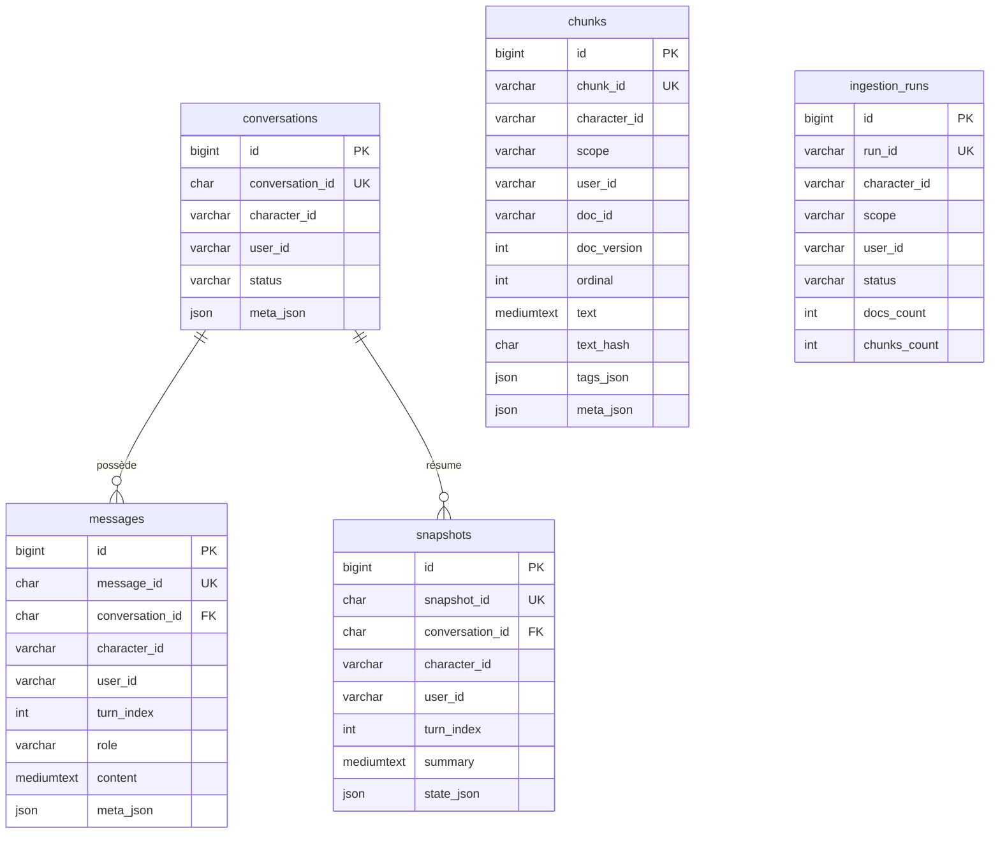
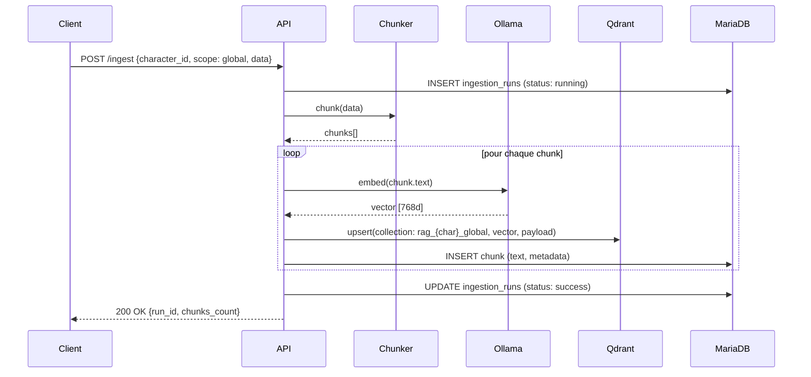
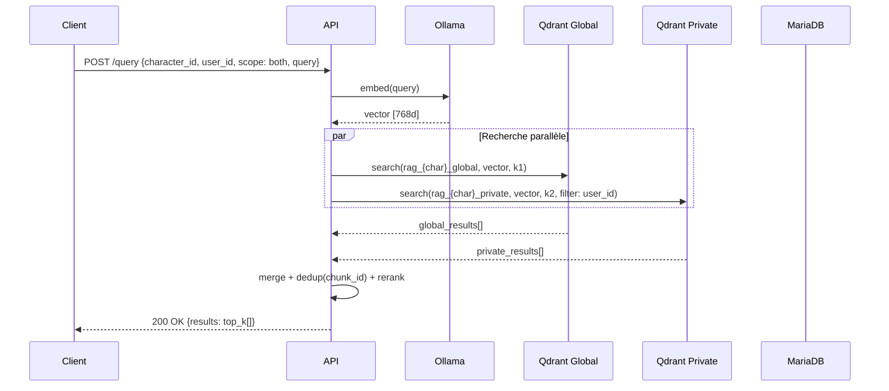

# RAG Luciana — Architecture

> Système RAG multi-personnage pour jeux vidéo avec isolation mémoire par utilisateur.

---

## 1. Vue d'ensemble

RAG Luciana est un service de **Retrieval-Augmented Generation** conçu pour des PNJ de jeux vidéo. Chaque personnage dispose de sa propre base de connaissances (lore global) et d'une mémoire conversationnelle privée par joueur.

```
┌─────────────────────────────────────────────────────────┐
│                      Client (Jeu)                       │
│              POST /query  ·  POST /ingest               │
└────────────────────────┬────────────────────────────────┘
                         │  HTTP / JSON
                         ▼
┌─────────────────────────────────────────────────────────┐
│                    FastAPI (API Gateway)                │
│   • Auth (JWT / API key)                                │
│   • Validation Pydantic                                 │
│   • Routage scope (global / private / both)             │
└───────┬──────────────────────┬──────────────────────────┘
        │                      │
        ▼                      ▼
┌───────────────┐    ┌─────────────────┐
│   Retrieval   │    │    Ingestion    │
│   Pipeline    │    │    Pipeline     │
│               │    │                 │
│ Qdrant search │    │ JSON → chunks   │
│ merge/rerank  │    │ embed → Qdrant  │
│ return top_k  │    │ persist → Maria │
└───┬───────┬───┘    └──┬──────────┬───┘
    │       │           │          │
    ▼       ▼           ▼          ▼
┌────────┐ ┌──────┐ ┌────────┐ ┌──────┐
│ Qdrant │ │Ollama│ │MariaDB │ │Ollama│
│(vector)│ │(embed│ │ (SQL)  │ │(embed│
│        │ │ding) │ │        │ │ding) │
└────────┘ └──────┘ └────────┘ └──────┘
```

---

## 2. Arborescence du projet

```
rag-luciana/
├── src/
│   └── rag_luciana/
│       ├── api/
│       │   ├── main.py              # FastAPI app
│       │   └── schemas.py           # Pydantic models (QueryRequest, QueryResponse…)
│       ├── ingest/
│       │   └── ingest_json.py       # CLI : ingestion JSON → DB + Qdrant
│       ├── core/
│       │   ├── chunking.py          # Découpage texte en chunks
│       │   ├── embeddings.py        # Appels Ollama embeddings
│       │   └── retrieval.py         # Recherche Qdrant, merge, rerank
│       ├── db/
│       │   ├── models.py            # ORM SQLAlchemy (MariaDB)
│       │   ├── session.py           # Engine / SessionLocal
│       │   └── repo.py              # CRUD documents, chunks, conversations
│       ├── clients/
│       │   ├── qdrant_client.py     # Wrapper Qdrant
│       │   └── ollama_client.py     # Wrapper Ollama
│       ├── settings.py              # BaseSettings (.env)
│       └── logging.py               # Configuration logging
├── migrations/                       # Alembic
├── tests/
│   ├── test_chunking.py
│   ├── test_ingest_idempotent.py
│   └── test_query_contract.py
├── infra/
│   └── docker-compose.yml           # MariaDB + Qdrant + Ollama
├── scripts/
│   ├── reset_vector_index.py
│   └── reindex_from_db.py
├── pyproject.toml
├── .env.example
└── README.md
```

---

## 3. Composants

### 3.1 API Gateway (`api/`)

| Endpoint | Méthode | Description |
|---|---|---|
| `/query` | POST | Recherche sémantique multi-scope |
| `/ingest` | POST | Ingestion d'un document JSON |
| `/health` | GET | Santé du service |

**Sécurité** : `user_id` est extrait du token JWT (pas du body) pour empêcher l'usurpation. Le `character_id` et le `scope` déterminent les collections/filtres appliqués.

### 3.2 Retrieval Pipeline (`core/retrieval.py`)

```
query text
   │
   ▼
embed(query) ──► vecteur [768d]
   │
   ├── scope=global  ──► Qdrant collection: rag_{character}_global
   ├── scope=private ──► Qdrant collection: rag_{character}_private
   │                      filtres: user_id, (conversation_id)
   └── scope=both    ──► les deux, puis merge + dedup par chunk_id
   │
   ▼
top_k résultats (score, text, metadata)
```

**Stratégie `both`** :
1. `k1 = ceil(top_k / 2)` résultats globaux
2. `k2 = top_k - k1` résultats privés
3. Concat + dédup par `chunk_id`
4. (Optionnel) rerank léger
5. Retourner `top_k`

### 3.3 Ingestion Pipeline (`ingest/`)

```
JSON document
   │
   ▼
Validation + extraction metadata
   │
   ▼
Chunking (par message, groupes de 2-4, ou summary)
   │
   ├──► MariaDB: INSERT chunks (text + metadata)
   │
   └──► Ollama embed → Qdrant upsert (vector + payload)
   │
   ▼
ingestion_runs: status = success/failed
```

**Idempotence** : chaque chunk est identifié par `chunk_id = sha256(character_id | doc_id | json_path | text_hash)`. Un re-import du même document ne duplique pas les données.

### 3.4 Clients externes (`clients/`)

| Client | Service | Rôle |
|--------|---------|------|
| `qdrant_client.py` | Qdrant | Stockage/recherche vectorielle |
| `ollama_client.py` | Ollama | Génération d'embeddings |

---

## 4. Modèle de données (MariaDB)

### 4.1 Diagramme des relations



### 4.2 Tables principales

| Table | Rôle | Clé de partitionnement |
|-------|------|------------------------|
| `conversations` | Sessions PNJ ↔ joueur | `(character_id, conversation_id)` |
| `messages` | Historique append-only | `(character_id, conversation_id, turn_index)` |
| `snapshots` | Résumés périodiques | `(character_id, conversation_id, turn_index)` |
| `chunks` | Texte + metadata pour rebuild | `(character_id, chunk_id)` |
| `ingestion_runs` | Traçabilité des imports | `(character_id, run_id)` |

---

## 5. Stockage vectoriel (Qdrant)

### 5.1 Stratégie de collections

Deux collections par personnage pour une **isolation stricte** :

| Collection | Contenu | Filtres appliqués |
|---|---|---|
| `rag_{character_id}_global` | Lore, règles, knowledge publique | `character_id` |
| `rag_{character_id}_private` | Mémoire conversationnelle | `character_id` + `user_id` + `conversation_id` |

### 5.2 Payload vectoriel

**Global** :
```json
{
  "character_id": "npc_jean",
  "scope": "global",
  "doc_id": "doc_...",
  "doc_version": 3,
  "chunk_id": "ch_...",
  "kind": "lore",
  "tags": ["hangar"],
  "json_path": "$.lore[2]",
  "source_uri": "internal://lore/npc_jean.json"
}
```

**Private** :
```json
{
  "character_id": "npc_jean",
  "scope": "private",
  "user_id": "user_42",
  "conversation_id": "9c2f0b4e-...",
  "doc_id": "conv_9c2f0b4e",
  "chunk_id": "ch_...",
  "kind": "memory",
  "tags": ["hangar", "key"],
  "json_path": "$.messages[17]"
}
```

---

## 6. Isolation & sécurité

### 6.1 Modèle de cloisonnement

```
                    ┌──────────────────────┐
                    │   scope = global     │
                    │   Pas de user_id     │
                    │   Lecture publique   │
                    └──────────────────────┘

  User A                                      User B
┌──────────────────┐                  ┌──────────────────┐
│ scope = private  │                  │ scope = private  │
│ user_id = A      │  ◄── ISOLÉ ──►   │ user_id = B      │
│ Mémoire perso    │                  │ Mémoire perso    │
└──────────────────┘                  └──────────────────┘
```

### 6.2 Checklist anti-fuite

| # | Règle | Couche |
|---|-------|------|
| 1 | `user_id` obligatoire pour scope `private` | App |
| 2 | Filtre Qdrant appliqué **avant** récupération | Vector DB |
| 3 | Tables SQL portent `character_id` + `scope` + `user_id` | SQL |
| 4 | `user_id` dérivé du token JWT, jamais du body | Auth |
| 5 | Tests : user A ne retrouve jamais un chunk user B | Tests |

### 6.3 Contraintes logiques (côté application)

- `scope = 'private'` → `user_id` **NON NULL**
- `scope = 'global'` → `user_id` **NULL**

---

## 7. Infrastructure

### 7.1 Services Docker

```yaml
# docker-compose.yml (simplifié)
services:
  api:
    build: .
    ports: ["8000:8000"]
    depends_on: [mariadb, qdrant, ollama]

  mariadb:
    image: mariadb:11
    volumes: [mariadb_data:/var/lib/mysql]

  qdrant:
    image: qdrant/qdrant:latest
    ports: ["6333:6333"]
    volumes: [qdrant_data:/qdrant/storage]

  ollama:
    image: ollama/ollama:latest
    ports: ["11434:11434"]
    volumes: [ollama_data:/root/.ollama]
```

### 7.2 Configuration (`.env`)

```env
# MariaDB
DB_HOST=mariadb
DB_PORT=3306
DB_NAME=rag_luciana
DB_USER=rag
DB_PASSWORD=secret

# Qdrant
QDRANT_HOST=qdrant
QDRANT_PORT=6333

# Ollama
OLLAMA_HOST=ollama
OLLAMA_PORT=11434
OLLAMA_EMBED_MODEL=nomic-embed-text

# API
API_HOST=0.0.0.0
API_PORT=8000
JWT_SECRET=change-me
```

---

## 8. Flux de données

### 8.1 Ingestion d'un document lore (global)



### 8.2 Query (scope = both)



---

## 9. Mémoire conversationnelle

La mémoire privée est construite à partir des tables `messages` et `snapshots`, transformée en documents JSON pour ingestion :

```json
{
  "type": "conversation_memory",
  "character_id": "npc_jean",
  "user_id": "user_42",
  "conversation_id": "9c2f0b4e-...",
  "messages": [
    {"turn": 1, "role": "user", "content": "..."},
    {"turn": 2, "role": "character", "content": "..."}
  ],
  "summary": "Résumé actuel ...",
  "state": {"relationship": 2, "quest_flags": ["HANGAR_KEY_PROMISED"]}
}
```

**Stratégies de chunking** :
- Par message individuel ou groupes de 2–4 messages
- Un chunk "summary" par snapshot
- Chunks "facts" extraits (entités, relations)

---

## 10. Contrats API

### 10.1 `POST /query`

**Request** :
```json
{
  "character_id": "npc_jean",
  "user_id": "user_42",
  "conversation_id": "9c2f0b4e-...",
  "query": "Que m'a dit Jean sur la clé du hangar ?",
  "top_k": 8,
  "scope": "private",
  "filters": {
    "tags": ["hangar"],
    "kinds": ["memory", "lore"]
  },
  "return_text": true
}
```

**Response** :
```json
{
  "query_id": "d7d4c0c4-...",
  "character_id": "npc_jean",
  "user_id": "user_42",
  "top_k": 8,
  "results": [
    {
      "chunk_id": "ch_01HZZ...",
      "doc_id": "doc_01HYY...",
      "score": 0.83,
      "text": "...",
      "metadata": {
        "scope": "private",
        "kind": "memory",
        "conversation_id": "9c2f0b4e-...",
        "source": "messages",
        "tags": ["hangar"]
      }
    }
  ]
}
```

---

## 11. Scripts utilitaires

| Script | Usage |
|--------|-------|
| `scripts/reset_vector_index.py` | Supprime et recrée les collections Qdrant |
| `scripts/reindex_from_db.py` | Re-génère les vecteurs depuis MariaDB (rebuild complet) |
